# 과제 진행 보고서 

## 프로젝트 개요 

- 목표 : mobile CLIP 이미지 특징 추출기와 sLLM를 활용한 이미지 캡션 모델 구현 
- 사용 기술 스택 
    - CLIP Image Encoder 
    - Contrastive Learning 
    - Projection Layer 기반 Feature Alignment
    - Small Language Model (sLLM)
    - LoRA fine tuning 
- 프로젝트 구조 
    1. 데이터 준비 및 전처리 
    2. Projection module을 활용한 특징 공간 매칭 
    3. CLIP(freeze) + Projection + sLLM(LoRA) fine tuning 
- 전체 파이프라인 

```
Image 
 ↓
CLIP Image Encoder 
 ↓
Image Feature (512 dim)
 ↓
Projection Layer
 ↓
Language Model Embedding Space (576 dim)
 ↓
sLLM Caption Generation
```

## 데이터 확인 

- 데이터셋 : Flickr8k

- 기초 통계 

| 항목 | 값 |
|-----|-----|
| 전체 이미지 | 8,091 |
| 전체 캡션 | 40,455 |
| 이미지 당 캡션 수 | 5 |

- 캡션 

| 항목 | 값 |
|-----|-----|
| 최소 단어 수 | 1 |
| 최대 단어 수 | 38 |
| 평균 단어 수 | 11.78 |
| 중앙값 | 11 |

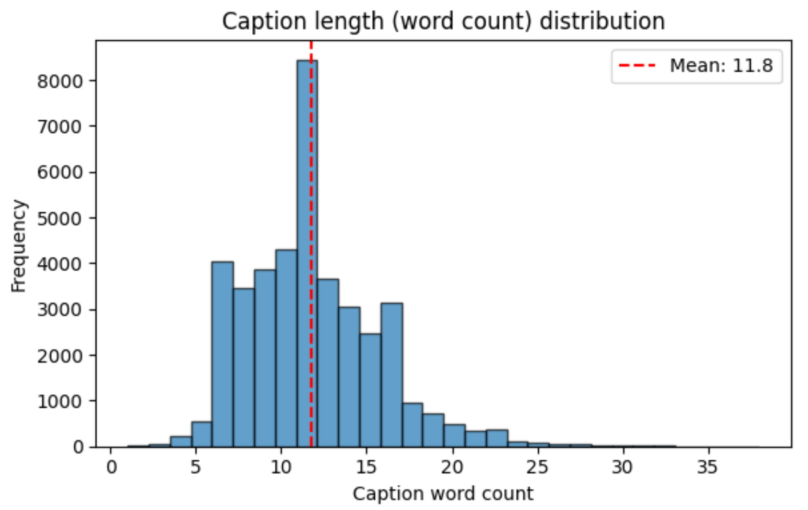

- 데이터 관련 문제 상황 및 핸들링 
    - 문제 상황 : 일부 캡션에서 의미 없는 문장 존재 
        - 예시 : 'A', 'a'
            - 이미지 2개 존재 (2428275562_4bde2bc5ea.jpg, 3640443200_b8066f37f6.jpg)
        - 이러한 캡션은 실제 이미지 설명 역할을 하지 못함 (노이즈)  
        - 또한, 2 단어 캡션도 존재 
            - 총 17개 이미지에서 존재 
    - 핸들링 
        - 1 단어 혹은 2 단어의 캡션은 묘사의 의미가 없다고 판단 
        - 텍스트 caption load 과정에서 3 단어 미만 caption은 배제 

## 진행 과정 설계 수립 

- 멀티모달 연구에서 널리 사용되는 2단계 학습 방식을 기반으로 설계 진행 
    - 이미지 인코더와 언어 모델을 직접 연결하는 대신 
    - 중간 정렬 단계(Embedding Alignment)를 우선 수행 후 캡션 생성 모델을 학습 
    - 대표적으로 
        - [ClipCap](https://arxiv.org/pdf/2111.09734) 
        - [BLIP-2](https://arxiv.org/pdf/2301.12597) 

- 본 프로젝트에서도 위와 같은 구조를 채택 

## Step 1 : Embedding Align  

### 목표 

- CLIP 이미지 특징 벡터를 언어 모델 임베딩 공간으로 정렬 
- 이미지 정보가 언어 모델 안에서 의미 있는 표현으로 사용될 수 있도록 함 

### 모델 구조 설계 

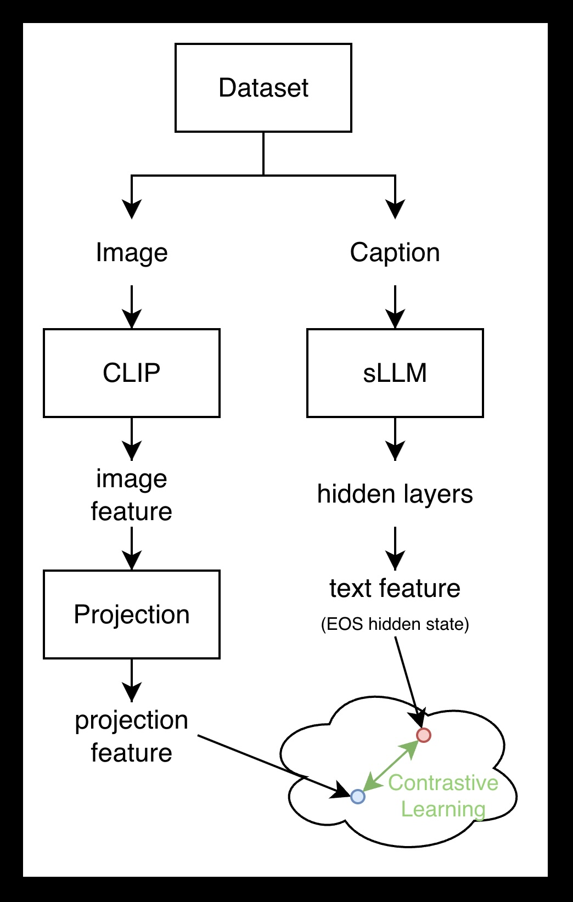

- Step1 구조도 
    - Flickr8k 데이터셋에서 이미지와 캡션 로드 
    - 이미지와 CLIP 모델을 활용해 image feature 생성 
    - 캡션을 sLLM 모델에 입력해 각 단어의 hidden state 도출 
    - hidden state의 마지막 단어 (EOS)의 hidden state를 text feature로 활용 
        - Transformer 계열 decoder에서 일반적으로 사용하는 문장 특징 추출 방법 
    - image feature와 text feature를 비슷한 space에 위치시키기위해 contrastive learning 방식 적용 
        - image feature의 크기와 text feature의 크기 매핑을 위해 Projection Module 구성 
        - Positive Pair : 이미지 - 캡션 쌍 
        - Negative Pair : 이미지 - 다른 이미지의 캡션 쌍 

- Projection Module 
    - Linear 
        - 단순히 크기 매핑을 위해 단층 퍼셉트론 활용 
    - MLP
        - 이미지와 텍스트 공간의 복잡한 패턴을 더욱 잘 분석하기 위해 
        - 비선형 함수를 포함하는 MLP 구성 (본 프로젝트에서는 2 layer 활용)
        - GeLU 비선형 함수 도입 

### 평가 지표 

- Retrieval 기반의 평가를 수행 
    - Cosine Similarity : embedding 유사도 
    - Recall@1 : top-1 retrieval (Best 모델 기준)
    - Recall@5 : top-5 retrieval 

### Step1 학습 결과 

| Metric | Value |
|-----|-----|
| Cosine Similarity | 0.0591 |
| Recall@1 | 0.1659 |
| Recall@5 | 0.4404 |

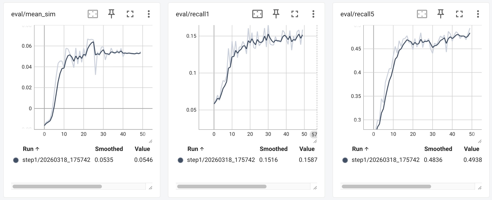

- 초기 1~10 epoch 까지는 폭발적으로 성능 향상 
- 이후 15~20 epoch 까지는 성능 향상 폭 점진적으로 감소 
- 그 이후로는 거의 plateau로 학습 완료 


### Ablation Study 

- Projection Module Type 
    - Linear vs MLP 
    - 결과 : Linear 
    - 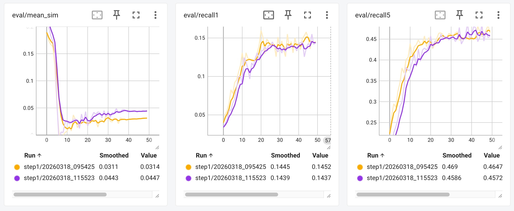
        - Linear : 노란색 (Recall@1 0.1577)
        - MLP : 보라색 (Recall@1 0.155)
    - 결과 분석 
        - 다수의 선행 연구에서는 비선형 함수와 더 많은 학습 파라미터를 포함한 MLP가 좋은 성능을 보인다고 설명 
        - 하지만 Flickr8k 데이터는 상대적으로 작은 양으로 그렇게 많은 표현력을 필요로하지 않아 보임 
        - Recall@1 기준 Linear의 성능이 조금 더 좋고, 작은 모델 크기로 해당 모듈을 선택하기로 함 

- Layer Norm 
    - Layer Norm 사용 유무 
    - 결과 : Layer Norm 활용 
    - 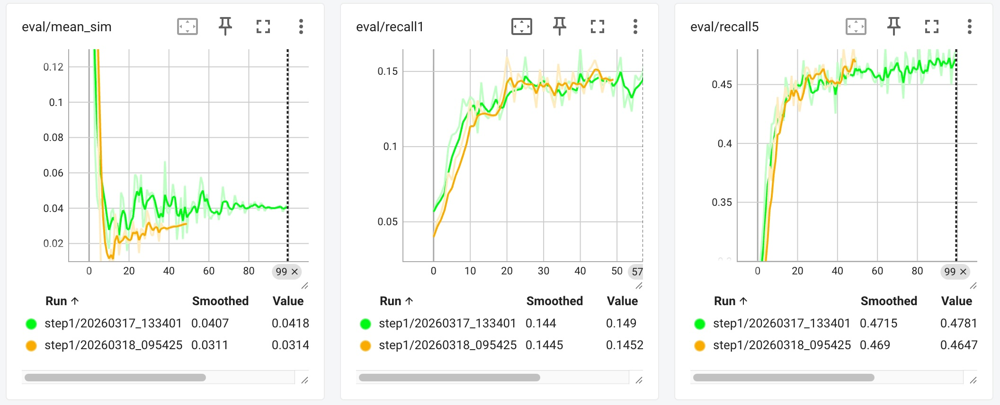
        - 노란색 : Layer Norm 사용 
        - 초록색 : Layer Norm 사용하지 않음 
    - 결과 분석 
        - Layer Norm 적용 시 Fluctuation이 줄어 안정적 수렴  
        - 학습 안정성 개선 

- Contrastive Temperature 
    - 0.07 vs 0.05 
    - 결과 : 0.05 
    - 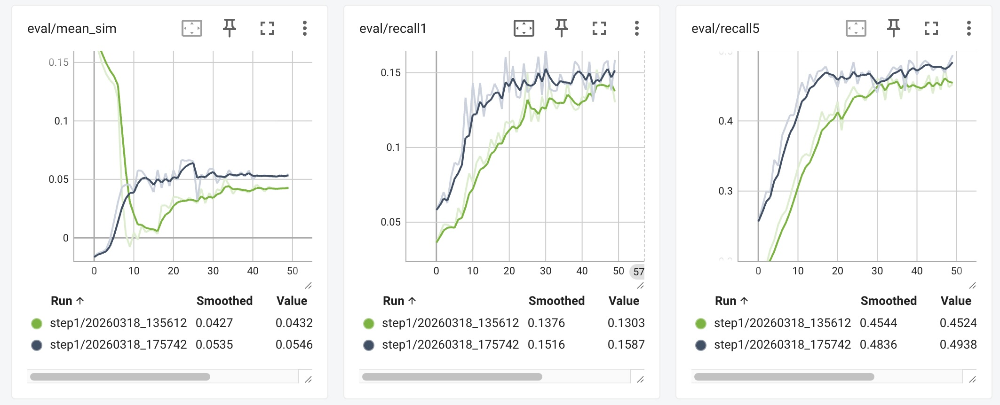
        - 회색 : 0.05 (Recall@1 0.1659)
        - 초록색 : 0.07 (Recall@1 0.1522)
    - 결과 분석 
        - 이미지 & 텍스트 특징의 유사도 계산 결과 logit을 scaling 하는 역할  
        - temperature 값이 작아지면 softmax 분포가 더욱 sharp 해지고 (logit이 커지므로)
        - positive pair에 대한 학습 신호가 강화됨  
        - 실험 결과 0.05가 0.07 설정보다 좋은 성능을 보임 

### 주요 하이퍼파라미터 

- epoch : 50 
- batch size : 512 
- optimizer : AdamW
- learning rate : 0.01 
- Cosine Annealing Scheduling (0.01 ~ 0.0001)


## Step 2 : Caption Model Fine-Tuning 

### 목표 

- Step1 에서 정렬된 Image feature를 활용 
- 이미지 기반 캡션 생성 모델을 학습 

### 모델 구조 설계 

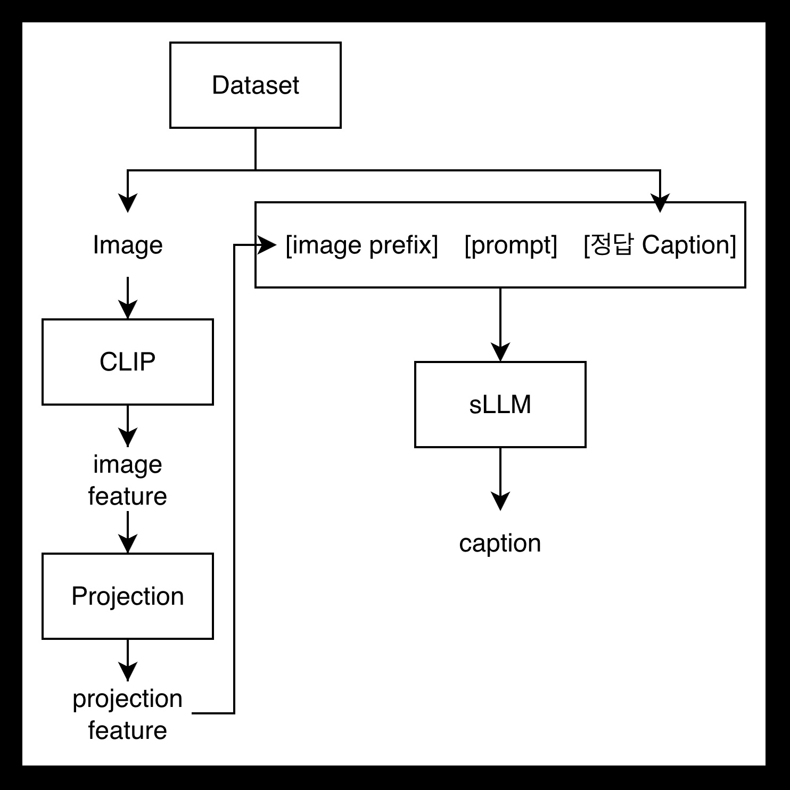

- Step2 구조도 
    - Flickr8k 데이터셋에서 이미지와 캡션 로드 
    - 이미지로부터 image feature 생성 (CLIP + step1의 Projection Module)
    - sLLM 모델에 입력을 위한 입력단 준비 
    - sLLM 모델을 활용한 캡션 출력 

- 입력단 
    - image prefix 
        - step1에서 학습된 projection 결과 
        - align이 완료된 상태로 sLLM 내부 feature shape에 맞춰진 상태 
    - prompt 
        - Caption task 수행을 위해 제공하는 입력 프롬프트 
        - 본 프로젝트에서는 "Caption: "라고 명시 
    - 정답 Caption 
        - 데이터셋에서 로드한 실제 정답 캡션 
        - 학습 과정에서 활용 

### 주요 하이퍼파라미터 

- epoch : 50 
- batch size : 128 
- optimizer : AdamW
- projection learning rate : 0.002
- lora learning rate : 0.001 
- lora r / alpha : 8 / 16 
- lora target module : q, v projection 
- Cosine Annealing Scheduling (target:  1e-6)


### 평가 지표 

- CIDEr 
- 구체적인 내용은 '평가' 파트에서 설명 

### Step2 학습 결과 

| Metric | Value |
|-----|-----|
| CIDEr (Flickr8k val) | 0.0387 |

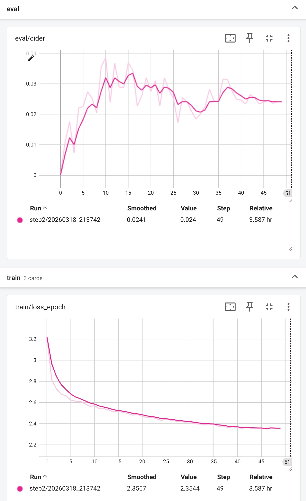

- 학습 Loss는 감소 경향을 보였고, CIDEr는 초반 상승 후 plateau에 도달
- 50 Epoch 기준 Best model을 최종 모델로 선정
- 추론 후 이미지에 대한 추가적인 질문을 진행하는 모델의 결과로 인해 후처리(cleaning 진행) 
    - [후처리 전] shirt and a woman in a white shirt are walking down a street . \n\n What is the name of the man in the red shirt and the woman in the white shirt?
    - [후처리 후] shirt and a woman in a white shirt are walking down a street .

### 추론 결과 

1. 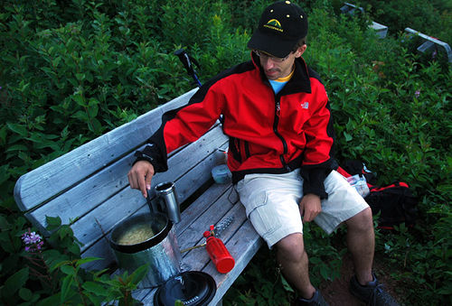
- 결과 : shirt and a blue shirt is playing a guitar .
2. 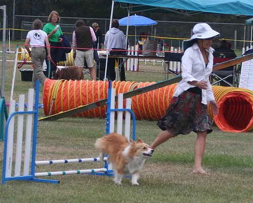
- 결과 : shirt and a woman in a white shirt are walking down a street .
3. 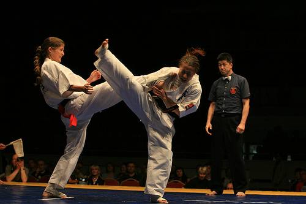
- 결과 : shirt and a woman in a white shirt are playing a guitar .

- CIDEr 0.0387과 추론 결과에 대한 고찰 
    - 현상 
        - 선행 연구 대비 낮은 CIDEr 수치 
        - 적절하지 않은 캡션 생성 결과 
            - 'shirt and' 와 같은 단어가 앞에 생성 
        - 외부 모습에 대한 묘사만 진행 
        - 이미지를 묘사하려는 모습이 다소 보이기는 함 
            - 기타를 잡고 있는 것 같은 모습
            - 뛰는 모습을 walk 라고 표현 
            - 등 
    - 가능한 원인
        - Flickr8k 소규모 데이터로 인한 표현력 한계 
        - 비슷한 어색 표현이 존재 → 절대적인 학습량이 부족 
        - Linear projection의 단순한 image–text 정렬 
        - epoch, beam search, Caption prompt 등 학습 & 추론 설정 부족 
    - 개선 방향 
        - 모델의 능력 확인 
            - 소규모 데이터 구성 후 강제 Overfitting 후 결과 확인 
        - 데이터 확대(Flickr30k, MSCOCO)
        - beam search & repetition penalty 적용
        - projection 구조 고도화(Q-Former 등)
        - 하이퍼파라미터 탐색

## 평가 

### 평가 메트릭 : CIDEr 

- 이미지 캡셔닝에 널리 사용되는 평가 지표 
- 생성된 캡션과 reference 캡션 사이의 유사도를 측정 
- 사람이 작성한 캡션 간의 합의 정도를 잘 반영하도록 설계 
- TF-IDF 기반으로, 특정 이미지에 특징적인 단어에 높은 가중치를 부여하는 특징이 있음 
- 0~10 사이의 값을 갖으며, 값이 클수록 이미지를 잘 설명했다고 볼 수 있음 
- 참고 모델에 따른 CIDEr 값 

| 모델 | CIDEr (COCO 기준) |
|-----|-----|
| ClipCap | ~0.9 |
| BLIP | ~1.2 |
| LlaVA-1.5 | ~1.3 |


### 평가 데이터 선정 

- Flickr30k 
    - 대표적인 image caption 벤치마크 데이터셋 (타 연구와의 비교 용이)
    - 학습에 사용하지 않은 같은 계열(Flickr)의 데이터이므로 실제 일반화 능력 확인 가능 
        - 평가에 사용하는 Flickr30k 데이터에서 학습 Flickr8k 데이터 제외 
    - 타 데이터를 활용하는 상황에서 발생되는 도메인 차이가 없어 모델 성능을 더욱 잘 반영 
    - 학습에 사용한 Flickr8k 데이터의 구조와 분포가 유사 

### 평가 결과 (eval.py 실행 결과)

- Flickr30k (Flickr8k train 제외) 평가: CIDEr 0.0639
- 참고 모델(ClipCap ~0.9, BLIP ~1.2) 대비 낮은 수치

## 한계점 및 개선 방향 

1. Projection Module 개선 

- 현재 Projection Module은 단순 Linear를 사용하고 있음 
- 이미지와 텍스트의 feature align을 위해 아래와 같은 구조를 시도해볼 수 있을 것 같음 
    - Q-Former 기반의 이미지 정보 고도화 
    - Cross Attention 기반의 LLM 내부 정보 주입 

2. 데이터 규모 

- Flickr8k는 비교적 작은 규모의 데이터 (~8k)
- Flickr30k 혹은 MSCOCO 활용 시 성능 향상을 기대할 수 있을 것 같음 

3. 다양한 Hyper parameter 탐색 

- step1과 step2의 여러 hyper parameter의 최적화가 완전히 진행되지 않았음 
- 성능이 좋아지는 최적의 조건을 더 탐색할 수 있을 것 같음 


## 참고 자료 
- [Clip](https://arxiv.org/pdf/2103.00020)
- [Frozen](https://arxiv.org/pdf/2106.13884)
- [ClipCap](https://arxiv.org/pdf/2111.09734) 
- [BLIP-2](https://arxiv.org/pdf/2301.12597) 
- [FROMAGe](https://arxiv.org/pdf/2301.13823)
- [LLaVA 1.0](https://arxiv.org/pdf/2304.08485)
- [LLaVA 1.5](https://arxiv.org/pdf/2310.03744)